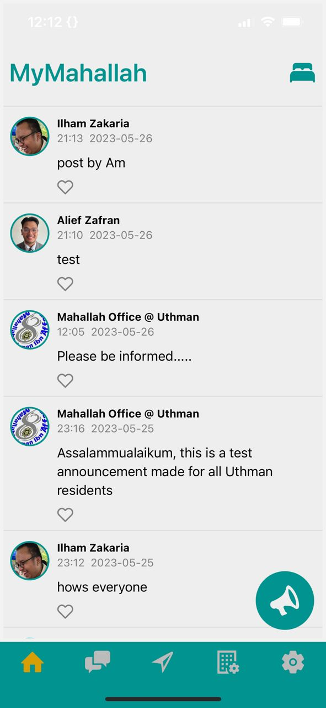
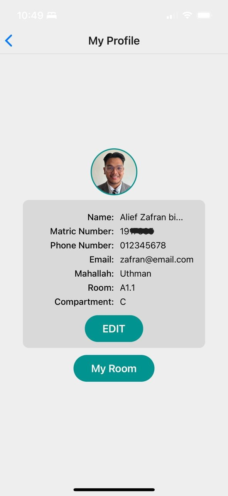
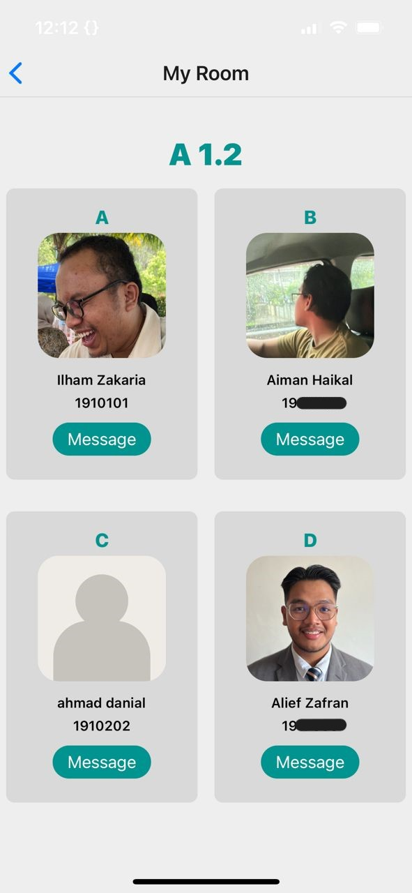
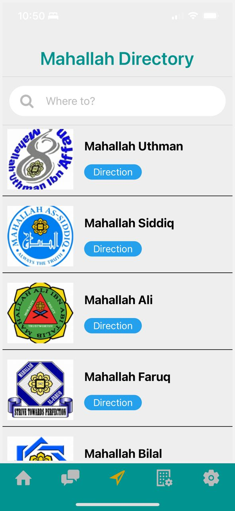
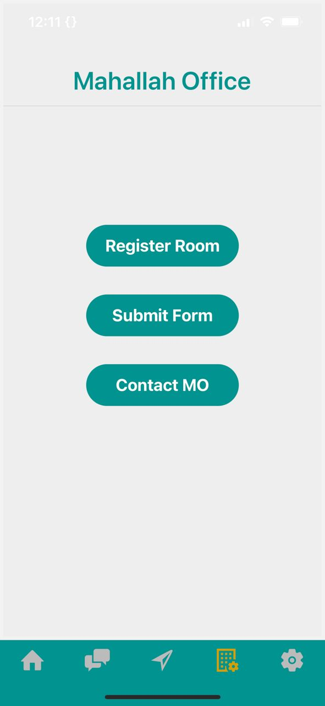
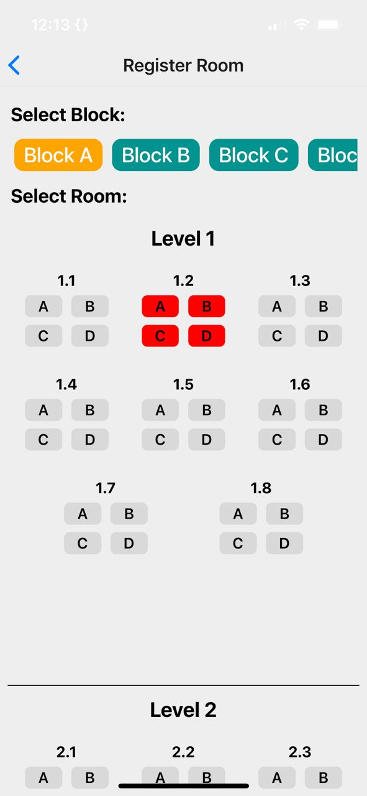
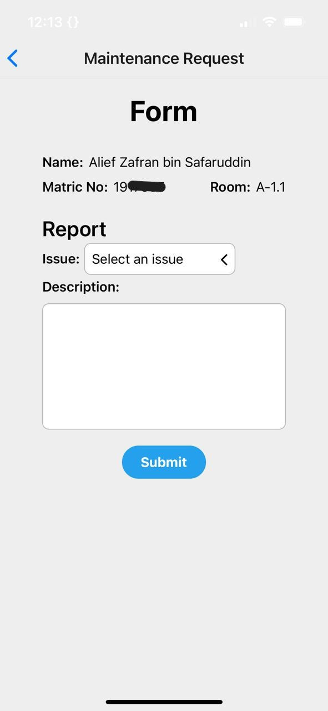
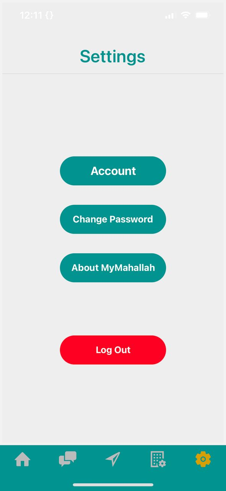

# MyMahallah

## Project Overview
MyMahallah is a project developed to improve the overall experience of students living in Mahallah by providing a centralized system for managing the living experience and facilitating communication and coordination within the Mahallah community. The MyMahallah mobile app is the primary component of the MyMahallah project, providing students with a convenient and efficient platform to manage their residency, communicate with peers, and access important information related to their Mahallah

## Key Features
1. Homepage: Enable students to post announcement and stay informed with announcements from the Mahallah Office and the Mahallah community.
2. Inbox: Communicate with fellow students through a dedicated messaging system.
3. Navigatory: Access information and directions for each Mahallah.
4. Mahallah Office: Register rooms, submit maintenance requests, and contact the Mahallah Office.
5. Settings: Manage your account and app preferences.

## Technologies Used
- React Native
- Firebase

## Interface
### Homepage

### Profile page

### Room page

### Inbox page

### Navigatory page

### Mahallah Office page

### Room Registration page

### Maintenance Request form

### Settings page
